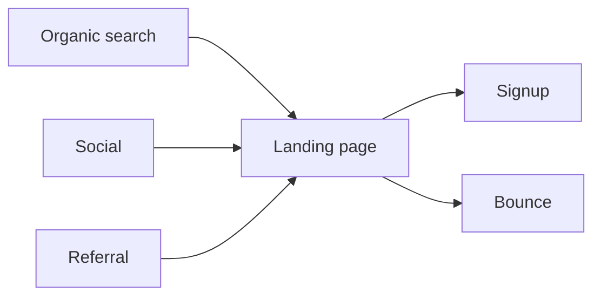

# Weekly acquisition report

Traffic increased **14%** this week, driven primarily by organic search. Signups kept pace, converting at 3.1% of visitors.

```chart
line
title: Daily visitors
summary: Daily visitors grew from 1,240 on Monday to a peak of 1,610 on Saturday before easing to 1,540 on Sunday.

date | Visitors
2026-08-03 | 1240
2026-08-04 | 1380
2026-08-05 | 1350
2026-08-06 | 1470
2026-08-07 | 1510
2026-08-08 | 1610
2026-08-09 | 1540
```

## Where visitors came from

```chart
bar
title: Visitors by channel
summary: Organic search led with 4,890 visitors, ahead of social (2,310), direct (1,750), and referral (1,150).

channel | Visitors
Organic search | 4890
Social | 2310
Direct | 1750
Referral | 1150
```

## Subscriber mix

```chart
pie
title: Subscribers by plan
summary: Free accounts make up about three quarters of subscribers; Pro is one fifth and Team the remainder.

plan | Subscribers
Free | 9120
Pro | 2480
Team | 640
```

## Acquisition flow



Next week we will watch whether the weekend lift in organic traffic holds.
